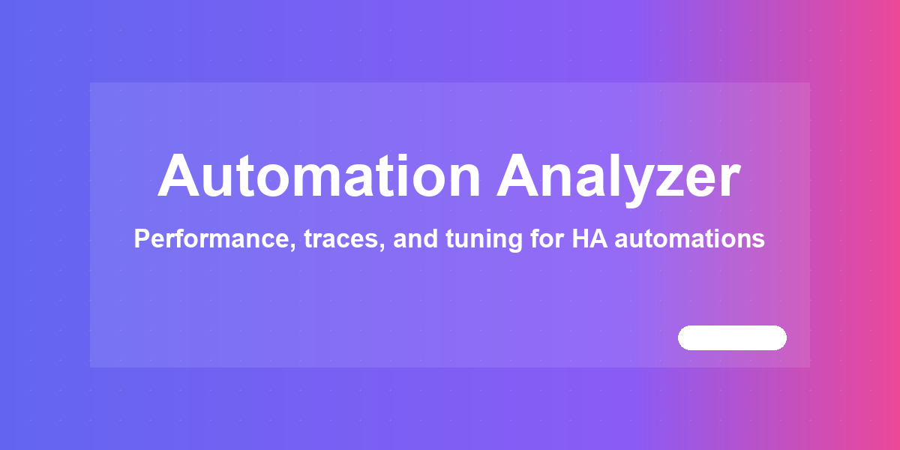

# HA Automation Analyzer



Analyze the health, activity and performance of your Home Assistant automations —
directly from a Lovelace card. Zero configuration: add the card and it discovers
every `automation.*` entity in your instance.

[](https://github.com/MacSiem/ha-automation-analyzer/releases) [](LICENSE)

## How it works

**Short version: it works automatically.** The card needs no configuration and no
extra integration:

1. **Instant overview from HA state.** On load, the card reads every `automation.*`
   entity (state, `last_triggered`) and immediately renders a system health score,
   total / active / disabled / error counts, and a searchable, sortable list —
   with zero API calls.
2. **Progressive, data-minimized enrichment.** The card reads the automation
   configuration needed for trigger/action/condition counts, keeps only those
   derived counts, and discards the raw configuration after the load completes.
   It does not fetch state history or traces from Overview or in the background.
3. **Traces only where requested.** Opening Timeline loads the selected automation's
   trace list and one selected run. An administrator can explicitly load one global
   trace-summary snapshot from Performance or Optimization. Home Assistant exposes
   `trace/list` and `trace/get` to administrators only; non-admin users see an honest
   capability message and the card makes no trace request.
4. **Trace limits apply.** Home Assistant keeps only the last 5 traces per automation
   by default and clears them on restart. For richer history, raise `stored_traces`
   in your automation configuration.

### What is automatic vs. manual

| Automatic | Manual (optional) |
|---|---|
| Discovering all automations | Loading global trace statistics (admin only) |
| Health score, activity and configuration analysis | Selecting or comparing Timeline runs (admin only) |
| Configuration-derived trigger/action/condition counts | Exporting a redacted local diagnostic file |
| No trace requests on Overview | Increasing `stored_traces` for deeper retained history |

## Screenshots

| Light | Dark |
|---|---|
|  |  |

*The Overview tab: system health score, counts, and the searchable automation list.
Dark mode follows your Home Assistant theme automatically.*

## Installation

1. Open HACS → Custom repositories.
2. Add `https://github.com/MacSiem/ha-automation-analyzer` as category **Dashboard**
   (Lovelace plugin).
3. Install **HA Automation Analyzer** and reload your browser.

## Quick start

```yaml
type: custom:ha-automation-analyzer
```

That's it — no options are required. Optional card-local settings are:

```yaml
type: custom:ha-automation-analyzer
title: Automation Analyzer
show_disabled: true
auto_refresh: true
```

`auto_refresh` accepts only a YAML boolean and defaults to `true`. Set it to
`false` to keep the current card snapshot until you explicitly reload the view.
It is not inherited from another panel and is not stored in browser storage.

## Tabs

- **Overview** — health score from entity state and available evidence, totals,
  full list with search, sort and time filters. Trace-derived errors and activity
  remain explicitly unknown until trace statistics are loaded.
- **Performance** — trigger types plus execution-time and retained-run activity
  after an optional, explicit admin-only trace-summary load.
- **Optimization** — state/config hints plus trace-derived slow/error findings only
  after that same explicit admin-only load.
- **Timeline** — an admin-only, locally paged list of retained runs, one full trace
  at a time, optional run comparison and redacted diagnostic export.

## FAQ

**Do I have to configure anything?**
No. Add the card and it discovers your automations by itself.

**Why are the Performance charts sparse?**
Home Assistant stores only the last 5 traces per automation by default and clears
them on restart. Use **Load trace statistics** as an administrator when you want
trace-based timings, and increase `stored_traces` per automation for more retained
data. The card never bulk-downloads full traces.

**What does the diagnostic export contain?**
Only a new allowlisted diagnostic structure: relative step offsets, normalized
statuses, run duration and an optional comparison. It excludes automation config,
triggers, variables, context, absolute timestamps, friendly names and Home
Assistant entity/device/area/user identifiers. Run identifiers are replaced with
local sequential aliases. The file is created locally in the browser and is not
uploaded.

**Does this send data anywhere?**
No telemetry and no external runtime requests — all analysis runs locally in your
browser against your Home Assistant instance. If Chart.js is not already available
in the Home Assistant frontend, the card shows a compact numerical fallback instead
of downloading a library from a CDN.

## Changelog

See [CHANGELOG.md](CHANGELOG.md).

## Support

- [Buy Me a Coffee](https://buymeacoffee.com/macsiem)
- [PayPal](https://www.paypal.com/donate/?hosted_button_id=Y967H4PLRBN8W)

## License

MIT, see [LICENSE](LICENSE).
