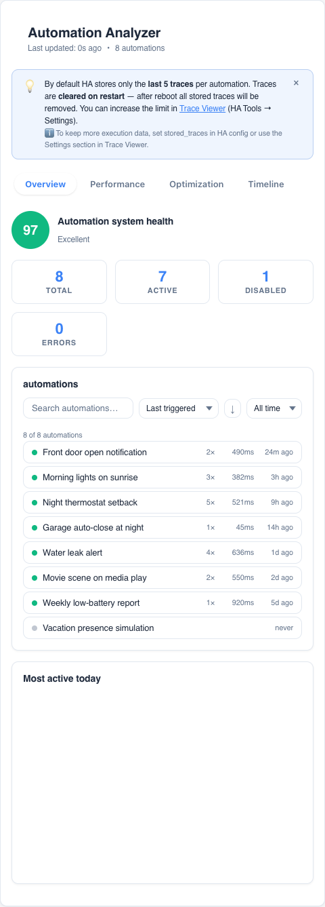
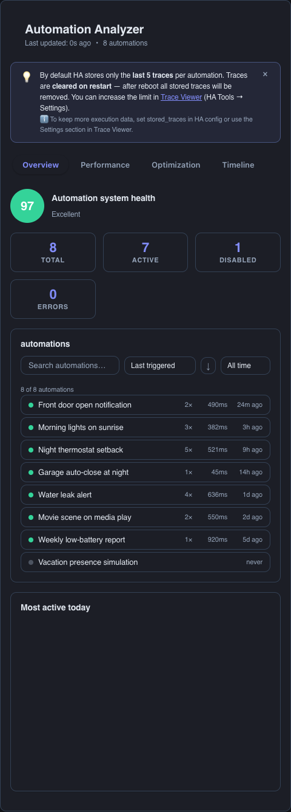

# HA Automation Analyzer

Analyze the health, activity and performance of your Home Assistant automations —
directly from a Lovelace card. Zero configuration: add the card and it discovers
every `automation.*` entity in your instance.

[](https://github.com/MacSiem/ha-automation-analyzer/releases) [](LICENSE)

## How it works

**Short version: it works automatically.** The card needs no configuration and no
extra integration:

1. **Instant overview from HA state.** On load, the card reads every `automation.*`
   entity (state, `last_triggered`) and immediately renders a system health score,
   total / active / disabled / error counts, and a searchable, sortable list —
   with zero API calls.
2. **Deeper analysis from traces.** In the background it fetches automation configs
   and execution traces (`trace/list`) to build the Performance, Optimization and
   Timeline tabs: execution time distribution, trigger types, daily activity and
   improvement hints.
3. **Trace limits apply.** Home Assistant keeps only the last 5 traces per automation
   by default and clears them on restart. For richer history, raise `stored_traces`
   in your automation configs (the card links to Trace Viewer for this).

### What is automatic vs. manual

| Automatic | Manual (optional) |
|---|---|
| Discovering all automations | Nothing required to start |
| Health score + activity list | Increasing `stored_traces` for deeper history |
| Trace-based performance stats | Acting on optimization hints |

## Screenshots

| Light | Dark |
|---|---|
|  |  |

*The Overview tab: system health score, counts, and the searchable automation list.
Dark mode follows your Home Assistant theme automatically.*

## Installation

1. Open HACS → Custom repositories.
2. Add `https://github.com/MacSiem/ha-automation-analyzer` as category **Dashboard**
   (Lovelace plugin).
3. Install **HA Automation Analyzer** and reload your browser.

## Quick start

```yaml
type: custom:ha-automation-analyzer
```

That's it — no options are required.

## Tabs

- **Overview** — health score, totals, most active automations, full list with
  search, sort and time filters.
- **Performance** — execution time distribution, trigger types, daily executions
  (requires traces; see note above).
- **Optimization** — hints such as never-triggered or long-running automations.
- **Timeline** — recent execution history.

## FAQ

**Do I have to configure anything?**
No. Add the card and it discovers your automations by itself.

**Why are the Performance charts sparse?**
Home Assistant stores only the last 5 traces per automation by default and clears
them on restart. Increase `stored_traces` per automation for more data.

**Does this send data anywhere?**
No. Everything runs locally in your browser against your Home Assistant instance —
no telemetry, no CDN assets.

## Changelog

See [CHANGELOG.md](CHANGELOG.md).

## Support

- [Buy Me a Coffee](https://buymeacoffee.com/macsiem)
- [PayPal](https://www.paypal.com/donate/?hosted_button_id=Y967H4PLRBN8W)

## License

MIT, see [LICENSE](LICENSE).
