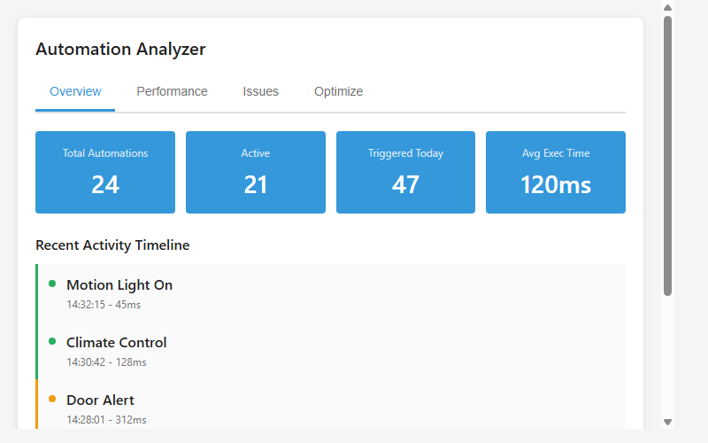
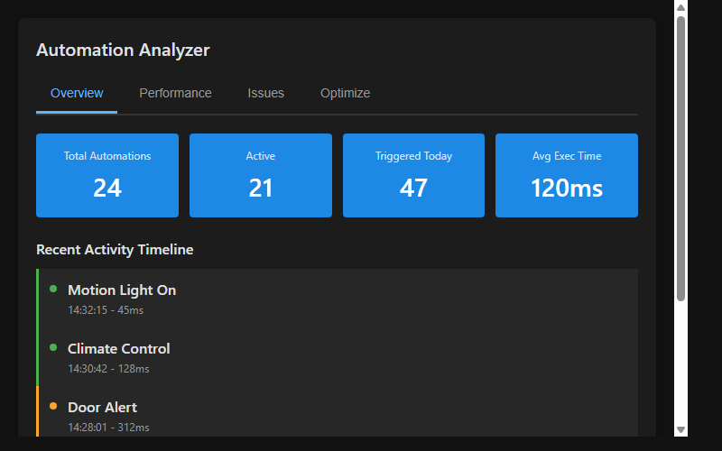

# Automation Analyzer Card for Home Assistant

A powerful Home Assistant custom card for analyzing, monitoring, and optimizing your automations. Track execution times, identify performance bottlenecks, detect conflicts, and get actionable optimization suggestions.

## Features

- **Overview Tab**: Real-time automation statistics, activity timeline, and top-fired automations
- **Performance Tab**: Execution time distribution, slowest automations, trigger type breakdown, and daily execution trends
- **Issues Tab**: Failed automation tracking, disabled automation detection, conflict identification, and stale automation alerts
- **Optimize Tab**: AI-driven optimization suggestions, complexity scoring, and resource usage estimates

## Installation

### Via HACS (Home Assistant Community Store)

1. Open HACS in Home Assistant
2. Click "Explore & Download Repositories"
3. Search for "Automation Analyzer"
4. Click "Download"
5. Restart Home Assistant

### Manual Installation

1. Create a directory `custom_components/automation_analyzer/` in your Home Assistant config
2. Copy `ha-automation-analyzer.js` into this directory
3. Add to your dashboard:

```yaml
type: custom:ha-automation-analyzer
title: Automation Analyzer
show_disabled: true
```

## Configuration

| Option | Type | Default | Description |
|--------|------|---------|-------------|
| `type` | string | Required | `custom:ha-automation-analyzer` |
| `title` | string | "Automation Analyzer" | Card title |
| `show_disabled` | boolean | true | Show disabled automations in analysis |

## Screenshots

Light theme:


Dark theme:


## Requirements

- Home Assistant 2021.8 or later
- Automations configured in Home Assistant
- Browser with Shadow DOM support

## License

MIT License - Feel free to use and modify
